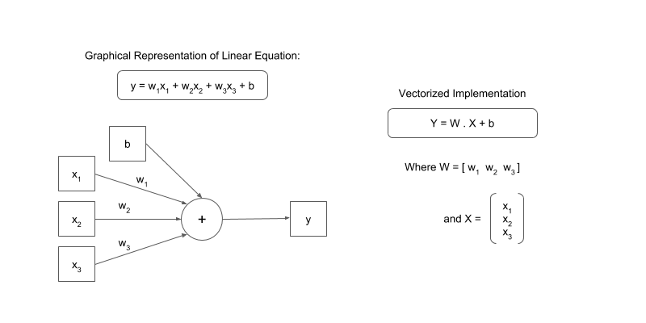

COURSERA_-_Basic-Image-Classification-with-TensorFlow
# COURSERA - Basic Image Classification with TensorFlow

---

## Project-Based Course Overview
- Welcome to TensorFlow Beginner: Basic Image Classification. This is a project-based course which should take approximately 2 hours to finish. Before diving into the project, please take a look at the course objectives and structure:

### Course Objectives
- In this course, we are going to focus on three learning objectives:

  1. Learn to create, train and evaluate neural network models with TensorFlow and Keras.
  2. Understand the basics of neural networks.
  3. Learn to solve classification problems with the help of neural networks.

- By the end of this course, you will be able to create a neural network model which will be able to classify images of hand written digits with a high degree of accuracy.

### Course Structure
- This course is divided into 4 parts:

  1. Course Overview: This introductory reading material.

  2. Basic Image Classification Project: This is the hands on project that we will work on in Rhyme.

  3. Ungraded Quiz: Check your understanding of the concepts learned in the hands on project with this ungraded quiz.

  4. Graded Quiz: This is the final assignment that you need to pass in order to finish the course successfully.

### Project Structure
- The hands on project on Basic Image Classification is divided into following tasks:

#### Task 1: Introduction
- Introduction to the basic image classification problem.
- What is TensorFlow?
- Introduction to the Rhyme interface.

#### Task 2: The Dataset
- Importing the MNIST dataset.
- A quick look at the structure of the dataset.
- A quick look at the MNIST image examples.

#### Task 3: One Hot Encoding
- What is one hot encoding?
- How to encode the labels from the dataset.

#### Task 4: Neural Networks
- Graphical representation of linear equations.
- What are neural networks?
- What are activation functions?

#### Task 5: Pre-processing the Examples
- Unrolling the input features.
- Data normalization with mean and standard deviation.

#### Task 6: Creating the Model
- Creating a sequential model with Keras.
- Model architecture - hidden layers and hidden units.
- Softmax and ReLU activation functions.
- Compiling the model by specifying an optimizer and a loss function.

#### Task 7: Training the Model
- Training the model to fit to training data.
- Evaluating the model on the test data.

#### Task 8: Predictions
- Predictions on the test set.
- Visualizing the predictions.

---
---


# My Steps :

### Task 1: Introduction

- Copy all template given in the workspace.

- Create Python Virtual Environment
  ```bash
  python3 -m venv COURSERA_PROJECT_VENV
  ```

- Activate Virtual Environment
  ```bash
  source COURSERA_PROJECT_VENV/bin/activate
  ```

- Installing JupyterLab and Jupyter Notebook
  ```bash
  pip3 install jupyter-lab notebook
  ```

- Installing Tensorflow
  ```bash
  pip3 install tensorflow
  ```

- Commented Line as it was using deprecated function of logging
  ```python
  # tf.compat.v1.logging.set_verbosity(tf.logging.ERROR)
  ```

---

### Task 2: The Dataset

#### 1. Import MNIST

- Added to shell to import the mnist dataset
  ```python
  from tensorflow.keras.datasets import mnist
  (x_train, y_train), (x_test, y_test) = mnist.load_data()
  ```
    Log : 
    ```text
    Downloading data from https://storage.googleapis.com/tensorflow/tf-keras-datasets/mnist.npz
    11490434/11490434 [==============================] - 2s 0us/step
    ```

- Will try to check the size of the train and test dataset.
  ```python
  print("x_train size :", len(x_train))
  print("y_train size :", len(y_train))
  print("x_test  size :", len(x_test))
  print("y_test  size :", len(y_test))
  ```
    Log : 
    ```python
    x_train size : 60000
    y_train size : 60000
    x_test  size : 10000
    y_test  size : 10000
    ```
    - Coming to conclusion there are 60000 Training Images and 10000 for Testing and Model Evaluation Purposes

#### 2. Shapes of Imported Arrays

- Displaying Shape of Numpy Arrays
  ```python
  print('x_train shape :', x_train.shape)
  print('y_train shape :', y_train.shape)
  print('x_test  shape :', x_test.shape)
  print('y_test  shape :', y_test.shape) 
  ```
    Log :
    ```python
    x_train shape : (60000, 28, 28)
    y_train shape : (60000,)
    x_test  shape : (10000, 28, 28)
    y_test  shape : (10000,)
    ```
    - (examples, rows, columns)
    - so there are 60000 and 10000 images of train and test respectively 
    - the 28, 28 represents the rows and columns of the image
    - Meaning that the resolution of image is 28x28 pixels

#### 3. Plot an Image Example

- Installing Matplotlib
  ```bash
  pip3 install matplotlib
  ```

- Importing Matplotlib
  ```python
  from matplotlib import pyplot as plt
  %matplotlib inline
  ```
    - ```%matplotlib inline``` tells the Jupyter Notebook to display images generated by matplotlib within the notebook.

- Plotting and Image with Matplotlib
  ```python
  test_image=12

  # Showing Input
  plt.imshow(x_train[test_image], cmap="binary")
  plt.show()

  # Showing Output (Class)
  print("Class Label : ", y_train[test_image])
  ```
    - The X is input and the Y is the Output Class / Label
    - cmap is color map.
    - cmap is set to 'binary' as all the dataset images are just Black and White

#### 4. Displaying Label 

- Print all the labels / classes of the train and test
  ```python
  print("y_train classes :",set(y_train))
  print("y_test  classes :",set(y_test))
  ```

---

### Task 3: One Hot Encoding

After this encoding, every label will be converted to a list with 10 elements and the element at index to the corresponding class will be set to 1, rest will be set to 0:

| original label | one-hot encoded label |
|------|------|
| 5 | [0, 0, 0, 0, 0, 1, 0, 0, 0, 0] |
| 7 | [0, 0, 0, 0, 0, 0, 0, 1, 0, 0] |
| 1 | [0, 1, 0, 0, 0, 0, 0, 0, 0, 0] |

#### 1. Encoding Labels

- For Encoding Labels : 
  ```python
  from tensorflow.keras.utils import to_categorical

  y_train_encoded = to_categorical(y_train)
  y_test_encoded  = to_categorical(y_test)
  ```
    - This will convert old value to a vector
    - Ex : 3 --> [0, 0, 0, 1, 0, 0, 0, 0, 0, 0]

#### 2. Validated Shapes

- To Validate Shape will print encoded classes shapes 
  ```python
  # Without Encoded Shape
  print('y_train shape :', y_train.shape)
  print('y_test  shape :', y_test.shape)

  # Encoded Shape
  print('y_train_encoded shape :', y_train_encoded.shape)
  print('y_test_encoded  shape :', y_test_encoded.shape)
  ```
    - Before it was just 1 dimensional.
    - Now each value has its own 10 elements vector **[One Hot Shot Encoded]**

- Why we did this encoding ?
  - The answer is we want to make a classifier not a regression model.
  - Having binary values for each class individually will make classification easy.
  - **Classification deals with categorical data.**

#### 3. Display Encoded Labels

- Just displaying Encoded Value and comparing with the original
  ```python
  print("y_train :", y_train_encoded[12], "--->", y_train[12])
  print("y_test  :", y_test_encoded[12], "--->", y_test[12])
  ```
- Output will be :
  ```python
  y_train : [0. 0. 0. 1. 0. 0. 0. 0. 0. 0.] ---> 3
  y_test  : [0. 0. 0. 0. 0. 0. 0. 0. 0. 1.] ---> 9
  ```  

---

### Task 4: Neural Networks



- In given image :
  | Symbol | Description |
  | --- | --- |
  | b | Interceptor/ Bias |
  | x1, x2, x3 | Input Parameters |
  | y | Output |
  | w1, w2, w3 | Weights |


- 28*28 = 784 Features
- Too many features... so the linear equation model it little complex to be applied.

##### Neural Network


- Activation Functions allows model to learn non linear patterns.

---

### Task 5: Preprocessing the Examples

#### 1. Unrolling N-dimensional Arrays to Vectors

- Import Numpy
  ```python
  import numpy as np
  ```

- Converting 2-dimensions image to 1-dimension vector
  ```python
  x_train_reshaped = np.reshape(x_train, (60000, 784))
  x_test_reshaped  = np.reshape(x_test, (10000, 784))
  ```

- Comparing old values vs new reshaped values :
  ```python
  print("x_train shape : ", x_train.shape)
  print("x_test  shape : ", x_test.shape)
  print("x_train_reshaped shape : ", x_train_reshaped.shape)
  print("x_test_reshaped  shape : ", x_test_reshaped.shape)
  ```
  - The Output is : 
    ```python
    x_train shape :  (60000, 28, 28)
    x_test  shape :  (10000, 28, 28)
    x_train_reshaped shape :  (60000, 784)
    x_test_reshaped  shape :  (10000, 784)
    ```

#### 2. Displaying Pixel Values

- Displaying all the unique values of the one example
  ```python
  print(set(x_train_reshaped[12]))
  ```
  - The Output will be :
    ```python
    {0, 2, 3, 4, 5, 6, 7, 8, 9, 12, 13, 15, 22, 23, 24, 25, 30, 33, 35, 45, 48, 49, 50, 52, 53, 54, 55, 58, 61, 63, 66, 67, 73, 74, 75, 86, 88, 90, 91, 99, 101, 103, 116, 118, 122, 125, 126, 127, 131, 137, 138, 140, 141, 142, 150, 152, 153, 154, 155, 158, 166, 168, 181, 182, 188, 189, 190, 191, 192, 194, 200, 202, 205, 209, 210, 220, 224, 234, 235, 241, 242, 246, 247, 248, 249, 250, 251, 252, 253, 254, 255}
    ```
  - It expresses that there are values from range 0-255.
  - It is normal for displaying images.
  - But for the model to learn different weight and biases for different layers the computation will be more effective and fast if we normalize this values.

#### 3. Data Normalization

- We will normalize the values of training set by calculating the mean and standard deviation.
  ```python
  x_mean = np.mean(x_train_reshaped)
  x_std  = np.mean(x_train_reshaped)
  ```
- Why Epsilon : if the values of x_std is too low will not effect data to be normalized so we add epsilon to help for better normalization
  ```python
  epsilon = 1e-10
  ```
- So for final normalization we will use this formula :
  ```python
  # For Training dataset :
  x_train_norm = (x_train_reshaped - x_mean) / (x_std + epsilon)

  # For Testing dataset :
  x_test_norm = (x_test_reshaped - x_mean) / (x_std + epsilon)
  ```

#### 4. Display Normalized Pixel Values

- Just displaying all the unique values form normalized data :
  ```python
  print(set(x_train_norm[12]))
  ```
  - The New values are much more smaller as compared to original data
  ```python
  {-0.9999999999969986, -0.6398388795779748, 1.731221829847265, 3.2619065916281156, 1.9713292434599472, 3.652081138748725, 6.3833029685929885, 4.4624436596915285, 2.9317588979106772, 3.1418528848217746, 6.6234103822056705, 6.5633835288025, 5.302819607335917, 6.05315527487555, 5.062712193723234, 6.413316395294574, 3.5920542853455544, 4.822604780110552, 6.443329821996159, 0.050469934558487375, 6.653423808907256, 6.2632492617866475, 2.7516783377011653, 3.982228832466163, 0.5006713350822671, -0.7298791596827308, 2.5415843507900684, 3.562040858643969, 5.60295387435177, 5.002685340320064, 6.023141848173965, 6.233235835085062, -0.3397046125621217, 0.8908458822028762, -0.5497985994732189, 1.7012084031456796, -0.3096911858605364, 0.3506042015743405, 0.4406444816790965, 3.742121418853481, 4.762577926707381, 2.0913829502662886, 3.111839458120189, 2.4815574973868975, 4.732564500005796, 0.7407787486949496, 5.152752473827991, 6.593396955504086, -0.00955691884468325, 1.2510070026219, 3.5020140052407984, 0.8308190287997055, 0.5606981884854377, -0.09959719894943919, -0.8799462931906573, -0.6098254528763896, 0.6207250418886083, -0.7598925863843161, -0.939973146593828, 0.590711615187023, -0.2796777591589511, -0.8499328664890721, 2.6616380575964094, -0.8199194397874867, 4.70255107330421, 1.641181549742509, 1.2209935759203145, 2.0313560968631177, 1.0108995890092174, 5.723007581158112, 6.533370102100915, 1.1909801492187293, 0.4706579083806818, 0.9808861623076321, 2.811705191104336, 3.2318931649265306, 4.672537646602626, 4.042255685869334, 5.272806180634332, 6.5033566753993295, 1.5811546963393384, 3.6220677120471394, 0.6507384685901937, -0.24966433245736577, -0.7899060130859014, 3.201879738224945, 4.432430232989943, 4.64252421990104, 6.473343248697744, 2.781691764402751, -0.9099597198922427}
  ```

---

### Task 6: Creating a Model

#### 1. Creating the Model

- The Model defined is : (2 hidden layer and 1 output layer)
  ```python
  from tensorflow.keras.models import Sequential
  from tensorflow import keras
  from tensorflow.keras import layers

  model = keras.Sequential([
      layers.Dense(128, activation="relu", input_shape=(784,)),
      layers.Dense(128, activation="relu"),
      layers.Dense(10, activation="softmax")
  ])
  ```
  - The first layer is the hidden input layer which takes input image.
  - It has 128 Nodes and uses **Relu** as activation function.
  - The Second layer is the hidden input layer with 128 Nodes and **Relu** Activation Function.
  - The last layer is output layer with 10 Nodes as output for each individual class and uses **softmax** activation function for Each class Probability Score.
- There are many types of activation function in Neural Networks.
- **Relu** is most used activation function.
- **Relu** is simply a linear function for all the positive values and it's simply set to zero for all the negative values.
- Another activation function we are using is **softmax**, and using on output layer.
- **Softmax** function gives the probability scores for various node.
- This probability scores are upto 1.

#### 2. Compiling the Model

- Defining few things to compile the model:
  ```python
  model.compile(
    optimizer='sgd',
    loss='categorical_crossentropy',
    metrics=['accuracy']
  )

  model.summary()
  ```
  - We will use optimizer function as 'sgd'
  - sgd stands for **Stochastic Gradient Descent**
  - also we need to define loss function as 'categorical_crossentropy'
  - and a metric to look at as model train ---> accuracy

- The output of model.summary() will be :
  ```python 
  Model: "sequential"
  _________________________________________________________________
  Layer (type)                Output Shape              Param #   
  =================================================================
  dense (Dense)               (None, 128)               100480    
                                                                  
  dense_1 (Dense)             (None, 128)               16512     
                                                                  
  dense_2 (Dense)             (None, 10)                1290      
                                                                  
  =================================================================
  Total params: 118,282
  Trainable params: 118,282
  Non-trainable params: 0
  _________________________________________________________________
  ```
  - Parameters are just # of nodes connected
  | Layer Name | Output Shape | Param # |
  |---|---|---|
  | dense | 128 | (748*128)+128 = 100480 |
  | dense_1 | 128 | (128*128)+128 = 16512 |
  | dense_2 | 10 | (128*10)+10 = 1290 |

---

### Task 7: Training the Model

#### 1. Training the Model

- Lets train the model 
  ```python
  model.fit(x_train_norm, y_train_encoded, epochs=3)
  ```
  - Here epochs means the number of times we will go through examples.
  - In our case going through examples 3 times gives acceptable accuracy so we will settle with epochs as 3.
  